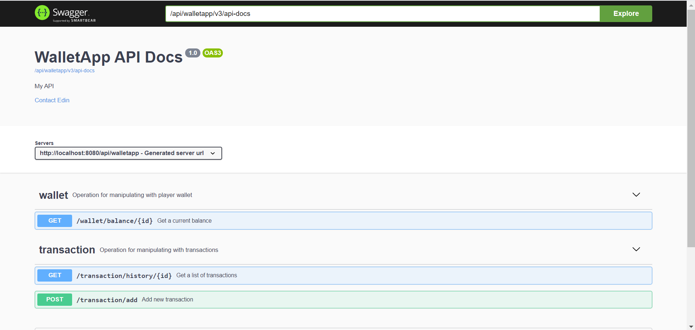
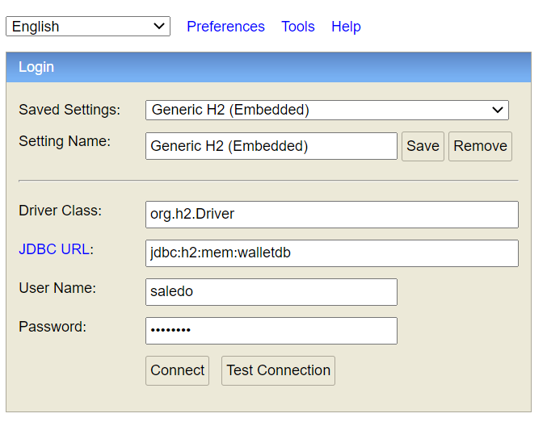

# Wallet Microservice

A simple wallet microservice running on the JVM that manages credit/debit
transactions on behalf of players.

### Description

A monetary account holds the current balance for a player.
The balance can be modified by registering transactions on the account, either debit
transactions (removing funds) or credit transactions (adding funds).

### Functionality

REST APIs were implemented that fulfils the requirements detailed
below and honours the constraints.

- Current balance per player
- Registering transaction on the account
    - Debit/Withdrawal per player. A debit transaction will only succeed if there are
sufficient funds on the account (balance - debit amount >= 0).
The caller will supply a transaction id that must be unique for all transactions. If the
transaction id is not unique, the operation must fail.
    - Credit per player. The caller will supply a transaction id that must be unique for all
transactions. If the transaction id is not unique, the operation must fail.
- Transaction history per player

## Getting started

The only constraint was to implement solution running on the JVM. For the purposes of this POC Java8 was used together with 
**SpringBoot** framework.

#### Why SpringBoot?

Framework is easy to use and create small projects and also contain everything needed for this implementation. 
Also previous experience had big role as this is framework that I used mostly in my career so far.

### Prerequisites

* Java8 has to be installed. 

* Optionally, you can install Maven. Maven Wrapper is inside repo and if you don't have maven you can use it.

### Running

If all prerequisites are satisfied just go into the repo root folder using cmd and run

    ./mvnw spring-boot:run

Maven will be downloaded (only first time) and **Wallet Microservice app** will be built and run. 
If everything is ok you will see inside logs that 

    Tomcat started on port(s): 8080 (http) with context path ''

and Swagger UI app can be accessed using browser (*http://localhost:8080/api/walletapp/swagger-ui.html*). There
you can see and also test all the implemented services. You will see also examples of calls with a description.

**Be sure that port 8080 is free.** Port can be changed using *application.properties* file. Just change value of 
*server.port* property and rerun application.

### Usage

If everything went well you should see something like this in your browser after you go to 
http://localhost:8080/api/walletapp/swagger-ui.html

If you don't want to use Swagger UI here is the list of API endpoints which are implemented:

- Current balance per player 

        GET http://localhost:8080/api/walletapp/wallet/balance/{playerId}
        Response body:
        {
            "id": 2, // id of player wallet inside db
            "created": "2020-08-26T23:02:56.104Z", // record creation time
            "updated": "2020-08-26T23:02:56.104Z", // record last update time
            "playerName": "Player 2", // player name
            "balance": 200.00 // player balance inside wallet
        }
- Registering transaction on the account

        POST http://localhost:8080/api/walletapp/transaction/add
        Request body:
        {
            "transactionId": "TRANS1", // transaction id sent from client
            "transactionType": "Debit", // type of transaction DEBIT or CREDIT
            "transactionAmount": 55.00 // transaction amount (format *.##)
            "playerId": 2 // id of player inside db
        }
        Response body:
        {
            "id": 5, // transaction id in DB
            "created": "2020-08-26T22:54:06.659Z", // record creation time
            "transactionId": "TRANS1", // transaction id sent from client
            "transactionType": "Debit", // type of transaction DEBIT or CREDIT
            "transactionAmount": 55.00 // transaction amount (format *.##)
            "playerId": 2 // id of player inside db
        }
- Transaction history per player

        GET http://localhost:8080/api/walletapp/transaction/history/{playerId}
        Response body (list of transactions): 
        [
            {
                "id": 5, // transaction id in DB
                "created": "2020-08-26T22:54:06.659Z", // record creation time
                "transactionId": "TRANS1", // transaction id sent from client
                "transactionType": "Debit", // type of transaction DEBIT or CREDIT
                "transactionAmount": 55.00 // transaction amount (format *.##)
            }
        ]

**For testing purposes there are 3 records inside Wallet DB table registered on startup
together with 15 records inside Transaction DB table, 5 for each player (wallet).**

### H2 DB (in-memory database)

H2 DB console can be accessed using browser (http://localhost:8080/api/walletapp/h2-console).
After you go to this link you should see something like this in your browser

Password is set inside *application.properties* (just set value of **spring.datasource.password** property).